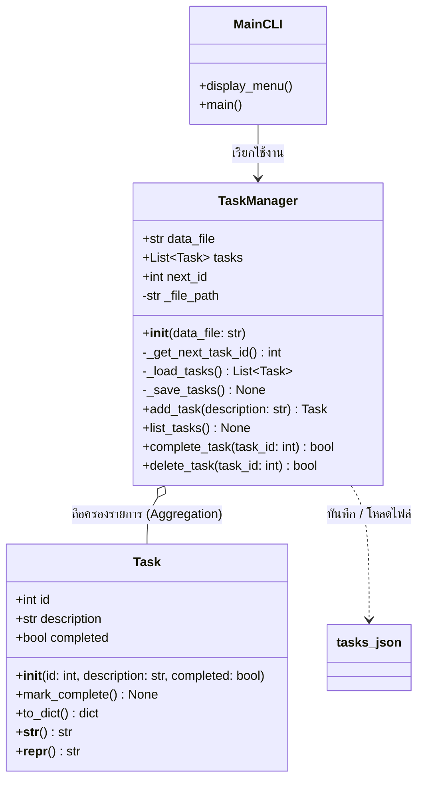

# 📘 คู่มือปฏิบัติการ: สัปดาห์ที่ 8
## การเขียนโปรแกรมเชิงวัตถุ (OOP Fundamentals) และการ Refactor ระบบจัดการงาน CLI

> **วิชา:** การเขียนโปรแกรมคอมพิวเตอร์ / การพัฒนาซอฟต์แวร์ (ระดับชั้นปีที่ 2)  
> **หัวข้อ:** คลาส (Class), ออบเจกต์ (Object), แอตทริบิวต์ (Attributes), เมธอด (Methods), ตัวแปร `self`, และการทำ Serialization ด้วย JSON

---

## 🎯 1. วัตถุประสงค์การเรียนรู้ (Learning Objectives)

เมื่อเสร็จสิ้นการทำแล็บนี้นักศึกษาจะสามารถ:
1. **อธิบายแนวคิดหลักของ OOP ได้:** เข้าใจความแตกต่างระหว่าง Class (พิมพ์เขียว) และ Object/Instance (สิ่งที่สร้างขึ้นจริง)
2. **สร้างและใช้งาน Class ในภาษา Python ได้:** กำหนด Constructor (`__init__`), สร้าง Instance Attributes และ Instance Methods
3. **เข้าใจหน้าที่ของตัวแปร `self` อย่างถูกต้อง:** ทราบว่า `self` คือตัวแทนของ Instance ปัจจุบันที่กำลังถูกเรียกใช้งาน
4. **ประยุกต์ใช้ Dunder (Magic) Methods ได้:** ใช้งาน `__str__` (สำหรับการแสดงผลแก่ User) และ `__repr__` (สำหรับการ Debug ของ Developer)
5. **ปรับปรุงโครงสร้างโค้ด (Refactor):** แปลงระบบจัดการงานแบบเดิม (Procedural ในสัปดาห์ที่ 7 ที่ใช้เพียง `dict` และฟังก์ชันกระจัดกระจาย) ให้กลายเป็นระบบ OOP ที่มีความเป็นโมดูลและขยายต่อได้ง่าย
6. **จัดการข้อมูลแบบคงทนร่วมกับ OOP (Persistence & Serialization):** แปลง Object เป็น Dictionary เพื่อจัดเก็บเป็น JSON และโหลด JSON กลับมาสร้างเป็น Object ได้
7. **ใช้งานเครื่องมือ Debugger ใน VS Code:** วาง Breakpoint, ใช้ Step Into (F11) เพื่อสังเกตการสร้าง Object และการเปลี่ยนแปลงค่าของ `self` ในหน่วยความจำ

---

## 🧠 2. ทำไมต้องเปลี่ยนเป็น OOP? (Procedural vs OOP)

ในสัปดาห์ที่ 7 เราเขียนโค้ดแบบ Procedural โดยเก็บข้อมูลของงานเป็น Dictionary ธรรมดา เช่น:
```python
# Procedural Style (สัปดาห์ที่ 7)
task = {"id": 1, "description": "Read book", "completed": False}
# หากต้องการเปลี่ยนสถานะ ต้องเขียนฟังก์ชันภายนอกมารับ dict ไปแก้
def mark_task_complete(task_dict):
    task_dict["completed"] = True
```

**ปัญหาที่พบเมื่อระบบใหญ่ขึ้น:**
- ไม่มีพิมพ์เขียวที่แน่นอน หากใครเผลอเขียน key ผิด เช่น `task["descripton"]` หรือลืมใส่ `completed` โปรแกรมจะพังตอนรันไทม์
- ข้อมูล (Data) กับฟังก์ชันการทำงาน (Behavior) แยกออกจากกัน ทำให้แก้ไขหรือติดตามบั๊กได้ยาก

**แนวคิดของ OOP (สัปดาห์ที่ 8):**
เราจะรวม **ข้อมูล** (State/Attributes) และ **พฤติกรรม** (Behavior/Methods) เข้าไว้ด้วยกันภายใต้หน่วยเดียวที่เรียกว่า **Object**
```python
# Object-Oriented Style (สัปดาห์ที่ 8)
task = Task(1, "Read book")
task.mark_complete()  # ตัว Object จัดการข้อมูลของตัวเองโดยตรง (Encapsulation)
```

---

## 🏛️ 3. แผนผังสถาปัตยกรรมและคลาสไดอะแกรม (Architecture & Class Diagram)



---

## 📂 4. โครงสร้างโปรเจกต์ (Project Structure)

```text
my-oop-task-manager/
├── src/
│   ├── __init__.py         # ระบุว่าโฟลเดอร์ src เป็น Python Package
│   ├── task.py             # Milestone 1: คลาส Task (ตัวแทนข้อมูลแต่ละงาน)
│   └── task_manager.py     # Milestone 2: คลาส TaskManager (จัดการคอลเลกชันงานและไฟล์)
├── tests/
│   ├── __init__.py
│   ├── test_task.py        # Unit tests สำหรับตรวจ Milestone 1
│   └── test_task_manager.py# Unit tests สำหรับตรวจ Milestone 2
├── data/
│   └── tasks.json          # ไฟล์จัดเก็บข้อมูลงาน (Persistence)
├── main.py                 # Milestone 3: หน้าจอเมนูและการรับข้อมูลผู้ใช้ (CLI)
├── .gitignore              # ไฟล์กำหนดสิ่งที่ไม่ต้อง commit เข้า Git
└── README.md               # เอกสารคู่มือปฏิบัติการนี้
```

---

## 🚀 5. ขั้นตอนการลงมือปฏิบัติทีละขั้น (Step-by-Step Milestones)

### 📌 Milestone 1: พัฒนาคลาส `Task` (`src/task.py`)
เปิดไฟล์ `src/task.py` และทำตามหัวข้อ TODO ดังต่อไปนี้:

1. **`__init__(self, id, description, completed=False)`**
   - ใช้ `self.id = id`
   - ใช้ `self.description = description`
   - ใช้ `self.completed = completed`
   - *ข้อสังเกต:* ค่า default ของ `completed` คือ `False`
2. **`mark_complete(self)`**
   - เปลี่ยนค่า `self.completed` ให้เป็น `True`
3. **`to_dict(self)`**
   - ส่งคืน `dict` ในรูปแบบ `{"id": self.id, "description": self.description, "completed": self.completed}`
4. **`__str__(self)`**
   - ส่งคืน String ที่จัดรูปแบบสำหรับ User ทั่วไป เช่น:
     `ID: 1 | Description: Buy groceries | Status: Pending`
   - *คำใบ้:* หาก `self.completed` เป็น `True` ให้แสดงคำว่า `Completed` มิฉะนั้นแสดง `Pending`
5. **`__repr__(self)`**
   - ส่งคืน String สำหรับนักพัฒนา/การดีบัก เช่น:
     `Task(id=1, description='Buy groceries', completed=False)`

#### 🧪 การตรวจสอบ Milestone 1:
รันคำสั่ง Unit Test ด้านล่างใน Terminal เพื่อตรวจว่าคลาส `Task` ผ่านการทดสอบทั้งหมดหรือไม่:
```bash
python -m unittest tests/test_task.py
```
*(หากผ่านทั้งหมด จะขึ้นข้อความ `OK`)*

---

### 📌 Milestone 2: พัฒนาคลาส `TaskManager` (`src/task_manager.py`)
เปิดไฟล์ `src/task_manager.py` คลาสนี้จะทำหน้าที่เป็น Controller ในการจัดการคลังงาน:

1. **`_get_next_task_id(self)`**
   - หาก `self.tasks` ว่างเปล่า ให้คืนค่า `1`
   - หากมีข้อมูลอยู่แล้ว ให้หาค่า `id` ที่สูงที่สุด แล้วบวก `1`
2. **`_load_tasks(self)` (Deserialization)**
   - อ่านข้อมูลจากไฟล์ JSON
   - แปลงข้อมูลดิบที่เป็น `dict` ให้กลายเป็น `Task` Object โดยเรียก `Task(item['id'], item['description'], item['completed'])`
3. **`_save_tasks(self)` (Serialization)**
   - แปลงทุก `Task` Object ใน `self.tasks` ให้กลายเป็น `dict` ผ่าน `task.to_dict()`
   - บันทึกลงไฟล์ JSON ด้วย `json.dump(...)`
4. **`add_task(self, description)`**
   - สร้าง `new_task = Task(self.next_id, description)`
   - เพิ่ม `new_task` ลงใน `self.tasks`
   - เพิ่มค่า `self.next_id += 1`
   - เรียก `self._save_tasks()` เพื่อบันทึกลงไฟล์
   - พิมพ์ข้อความแจ้งเตือน และคืนค่า `new_task`
5. **`list_tasks(self)`**
   - หากไม่มีงาน ให้พิมพ์ `"No tasks found."`
   - หากมีงาน ให้วนลูปพิมพ์ `task` แต่ละตัวออกมา (Python จะเรียก `task.__str__()` โดยอัตโนมัติ)
6. **`complete_task(self, task_id)`**
   - วนลูปหา task ที่ตรงกับ `task_id`
   - หากเจอ: เรียก `task.mark_complete()`, เรียก `self._save_tasks()`, พิมพ์แจ้งเตือน และคืนค่า `True`
   - หากไม่เจอ: พิมพ์แจ้งเตือนและคืนค่า `False`
7. **`delete_task(self, task_id)`**
   - กรองรายการงานที่ไม่ต้องการลบออก หรือลบตัวที่ตรงกับ `task_id`
   - หากจำนวนงานลดลง: เรียก `self._save_tasks()`, แจ้งเตือน และคืนค่า `True`
   - หากไม่พบงาน: แจ้งเตือนและคืนค่า `False`

#### 🧪 การตรวจสอบ Milestone 2:
รันคำสั่ง Unit Test ด้านล่าง:
```bash
python -m unittest tests/test_task_manager.py
```
*(หากผ่านทั้งหมด จะขึ้นข้อความ `OK`)*

---

### 📌 Milestone 3: ทดสอบการทำงานของ CLI Application (`main.py`)
เมื่อ Milestone 1 และ 2 ผ่านแล้ว ให้เปิดไฟล์ `main.py` แล้วทดลองรันโปรแกรมจริง:

```bash
python main.py
```

**สิ่งที่นักศึกษาต้องทดสอบ:**
1. ทดลองเลือกเมนู `1` เพื่อเพิ่มงาน เช่น `"อ่านหนังสือ OOP"` และ `"ทำแล็บสัปดาห์ที่ 8"`
2. เลือกเมนู `2` เพื่อแสดงรายการงานทั้งหมด (สังเกตสถานะว่าต้องเป็น Pending)
3. เลือกเมนู `3` เพื่อระบุ ID งานที่ต้องการทำเครื่องหมายว่าเสร็จแล้ว
4. เลือกเมนู `2` อีกครั้งเพื่อดูสถานะที่เปลี่ยนเป็น Completed
5. ออกจากโปรแกรมด้วยเมนู `5` แล้วเปิดไฟล์ `data/tasks.json` ดูว่าข้อมูลถูกบันทึกจริงหรือไม่
6. เปิดโปรแกรมใหม่อีกครั้ง และเลือกเมนู `2` เพื่อยืนยันว่าข้อมูลเก่ายังคงอยู่ครบถ้วน

---

### 📌 Milestone 4: การใช้งาน Visual Studio Code Debugger
หนึ่งในทักษะสำคัญของนักศึกษาปีที่ 2 คือการเข้าใจการทำงานของหน่วยความจำผ่าน Debugger:

1. **ตั้งจุด Breakpoint (จุดสีแดงด้านหน้าเลขบรรทัด):**
   - ใน `main.py` ที่บรรทัด `manager = TaskManager()`
   - ใน `src/task.py` ภายในฟังก์ชัน `__init__`
2. **เริ่มการ Debug:**
   - กดคีย์ลัด **`F5`** หรือคลิกที่แท็บ **Run and Debug** ด้านซ้าย แล้วเลือก **Python File**
3. **สังเกตตัวแปรในหน้าต่าง Variables:**
   - เมื่อโปรแกรมหยุดที่ `manager = TaskManager()` ให้กด **`F11` (Step Into)**
   - สังเกตว่าโปรแกรมจะกระโดดเข้าไปทำงานใน Constructor `__init__` ของ `TaskManager`
   - สังเกตตัวแปร **`self`** ในแผงซ้ายมือ ว่ามี Attributes อะไรเกิดขึ้นบ้าง
   - เมื่อถึงการสร้าง `Task` ให้กด `F11` เข้าไปดูว่า `self.id`, `self.description`, `self.completed` ถูกผูกเข้ากับ Object อย่างไร

---

## 🌟 6. โจทย์ท้าทายระดับสูง (Bonus / Advanced Challenge)

สำหรับนักศึกษาที่ต้องการคะแนนพิเศษหรือต้องการพัฒนาทักษะเพิ่มเติม:

1. **เพิ่มระดับความสำคัญ (Priority):**
   - เพิ่มแอตทริบิวต์ `priority` ให้กับคลาส `Task` (เช่น `'High'`, `'Medium'`, `'Low'` โดยมีค่าเริ่มต้นเป็น `'Normal'`)
   - อัปเดต `to_dict()` และ `__str__()` ให้แสดง Priority ด้วย
   - เพิ่มตัวเลือกระบุ Priority ในเมนูของ `main.py`
2. **เพิ่มฟังก์ชันค้นหางาน (Search Task):**
   - เพิ่มเมธอด `search_tasks(self, keyword: str)` ใน `TaskManager` เพื่อค้นหางานที่มีคำค้นหาปรากฏอยู่ใน description

---

## 📊 7. เกณฑ์การประเมินคะแนน (Grading Rubric)

| เกณฑ์การประเมิน | สัดส่วนคะแนน | รายละเอียด |
| :--- | :---: | :--- |
| **1. คลาส `Task` (Milestone 1)** | 25% | สร้าง Constructor ถูกต้อง, มี Instance Attributes ครบถ้วน, ใช้งาน `mark_complete`, `to_dict`, `__str__`, `__repr__` ได้ถูกต้อง และผ่าน Unit Test ทั้งหมด |
| **2. คลาส `TaskManager` (Milestone 2)** | 35% | จัดการ Collection ได้ถูกต้อง, ฟังก์ชัน Add/List/Complete/Delete ทำงานถูกต้องตามหลัก OOP, Auto-increment ID ทำงานได้แม่นยำ และผ่าน Unit Test ทั้งหมด |
| **3. การจัดเก็บข้อมูล (Data Persistence)** | 20% | โหลดและบันทึกไฟล์ `tasks.json` ได้อย่างสมบูรณ์ ข้อมูลไม่สูญหายเมื่อปิดโปรแกรม และจัดการ Error ได้ถูกต้อง |
| **4. ความสมบูรณ์ของ CLI & Error Handling** | 10% | ดักจับกรณีผู้ใช้กรอกข้อความว่างเปล่า หรือกรอกตัวอักษรแทนตัวเลข Task ID ได้โดยโปรแกรมไม่ Crash |
| **5. รูปแบบโค้ดและความเรียบร้อย (Code Style & Git)** | 10% | มีการตั้งชื่อตัวแปรที่สื่อความหมาย (PEP 8), มี Docstrings และ Commit งานขึ้น Git อย่างเป็นระบบ |
| **รวม** | **100%** | |

---

## 📝 8. คำแนะนำในการส่งงาน (Submission Checklist)

ก่อนส่งงาน ตรวจสอบให้แน่ใจว่า:
- [ ] รันคำสั่ง `python -m unittest discover tests` แล้วผ่าน **100%** ไม่มี Error หรือ Failure
- [ ] ทดลองเปิดปิด `main.py` และตรวจสอบว่าไฟล์ `data/tasks.json` มีข้อมูลถูกบันทึกจริง
- [ ] ลบไฟล์ขยะ เช่น โฟลเดอร์ `__pycache__` ก่อนนำไฟล์ขึ้น Git หรือบีบอัดไฟล์ส่ง
- [ ] Push โค้ดทั้งหมดขึ้น GitHub Repository ของนักศึกษา และแนบลิงก์ส่งในระบบส่งการบ้าน
